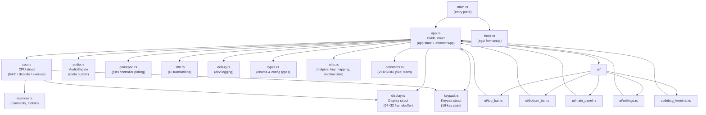
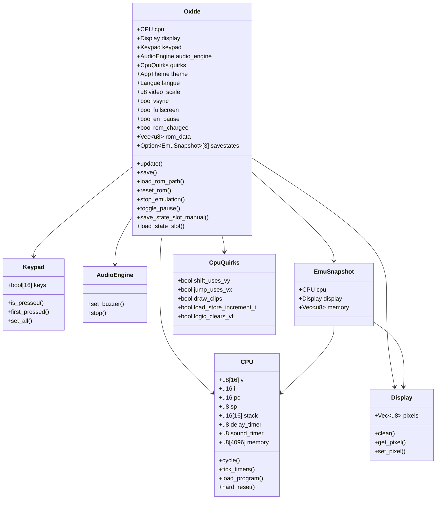
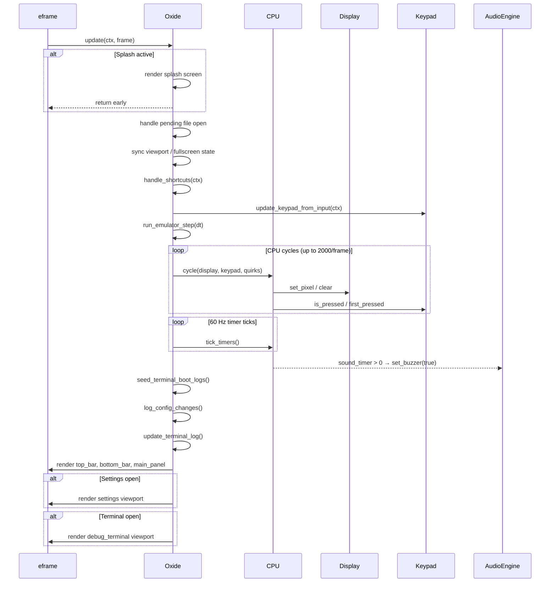
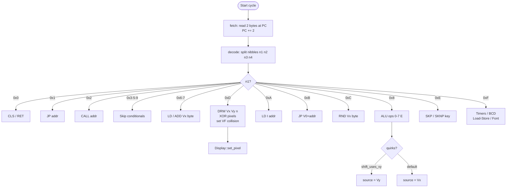
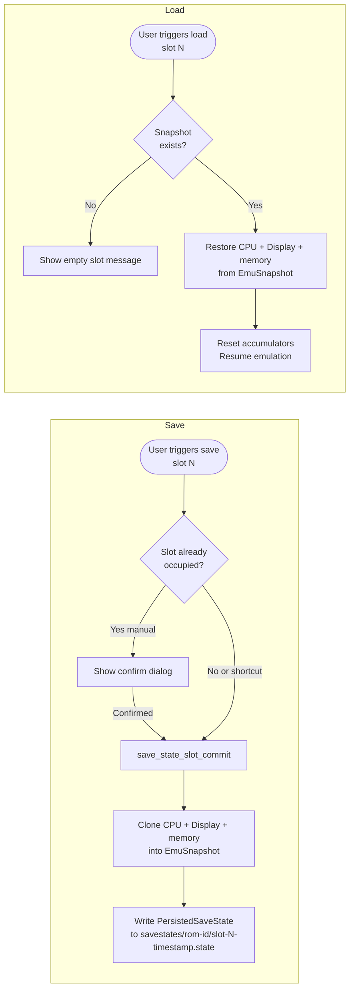
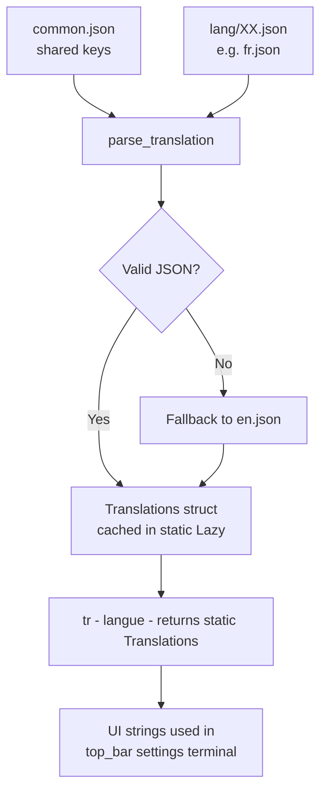
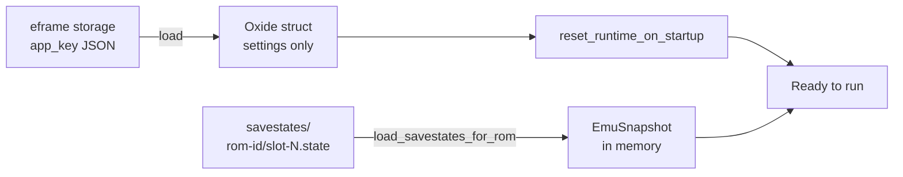

# Oxide — Architecture

Oxide is a CHIP-8 emulator written in Rust, built on top of [egui](https://github.com/emilk/egui) / [eframe](https://github.com/emilk/eframe_template). This document describes the crate layout, module responsibilities, and the key data flows at runtime.

---

## Module Map

---

## Core Data Structures

---

## Frame Update Loop

Every frame, `eframe` calls `Oxide::update()`. The sequence is:

---

## CPU Instruction Cycle

---

## Save State Flow

---

## I18n System

---

## Quirks Presets

| Quirk | CHIP-8 | CHIP-48 | SUPER-CHIP |
|---|---|---|---|
| `shift_uses_vy` | ❌ | ✅ | ✅ |
| `jump_uses_vx` | ❌ | ✅ | ✅ |
| `draw_clips` | ❌ | ❌ | ✅ |
| `load_store_increment_i` | ❌ | ❌ | ❌ |
| `logic_clears_vf` | ❌ | ❌ | ❌ |

---

## Persistence Strategy

`eframe` serializes the `Oxide` struct via `serde` on exit. Fields tagged `#[serde(skip)]` are **not** persisted (runtime-only handles, textures, log buffers). On startup the saved JSON is deserialized and runtime fields are re-initialized.

Save states are stored separately as JSON files under `savestates/<rom_name>-<fnv1a_hash>/`.

