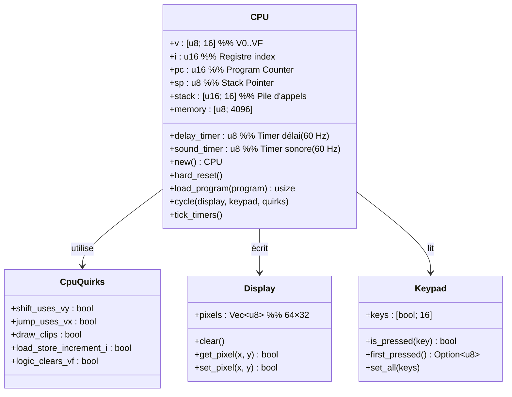
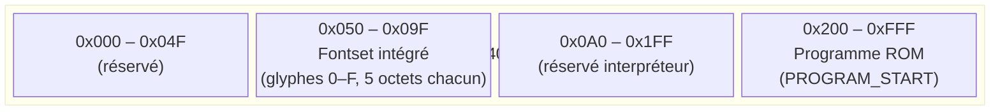
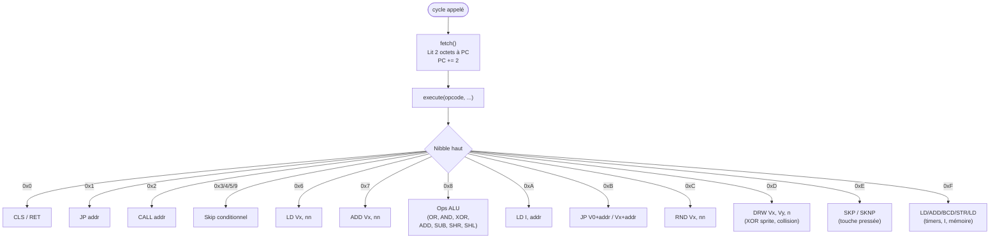
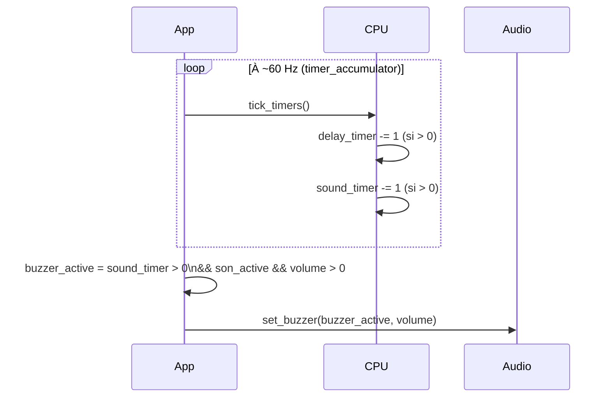
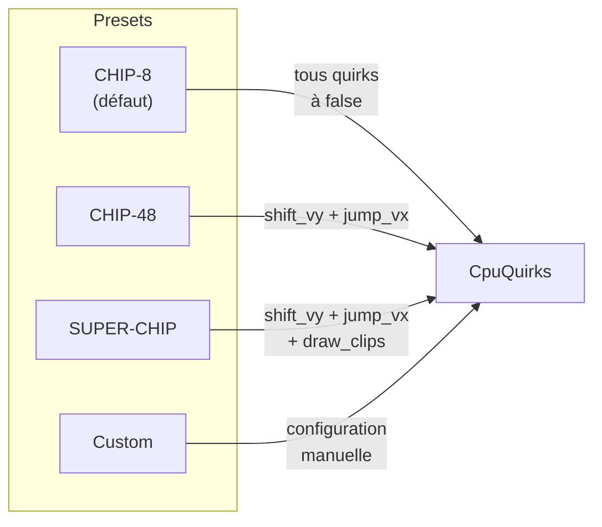
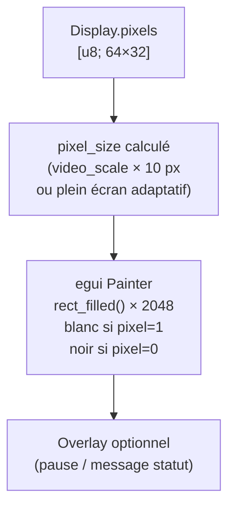

# Oxide — CPU & Émulation CHIP-8

Documentation technique du cœur d'émulation CHIP-8 d'Oxide.

---

## Registres du CPU CHIP-8

---

## Disposition de la mémoire CHIP-8

---

## Cycle d'exécution CPU

---

## Gestion des timers

---

## Quirks de compatibilité

| Quirk | CHIP-8 | CHIP-48 | SUPER-CHIP | Effet |
|---|:---:|:---:|:---:|---|
| `shift_uses_vy` | ❌ | ✅ | ✅ | `8xy6/8xyE` décale VY plutôt que VX |
| `jump_uses_vx` | ❌ | ✅ | ✅ | `Bxnn` saute à `Vx + nnn` |
| `draw_clips` | ❌ | ❌ | ✅ | Les sprites sont coupés aux bords |
| `load_store_increment_i` | ❌ | ❌ | ❌ | `Fx55/Fx65` incrémentent I |
| `logic_clears_vf` | ❌ | ❌ | ❌ | Ops logiques remettent VF à 0 |

---

## Rendu de l'affichage CHIP-8

