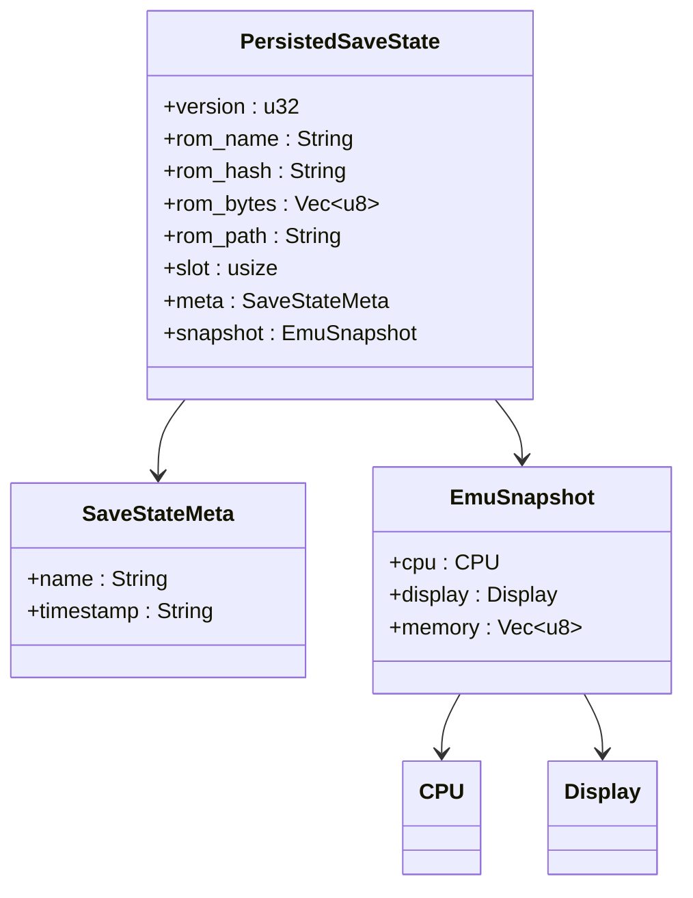
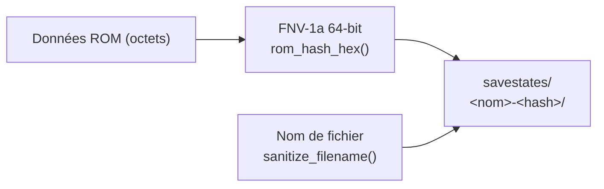
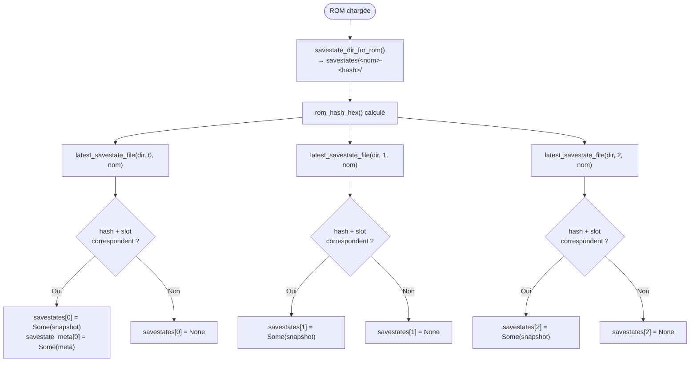
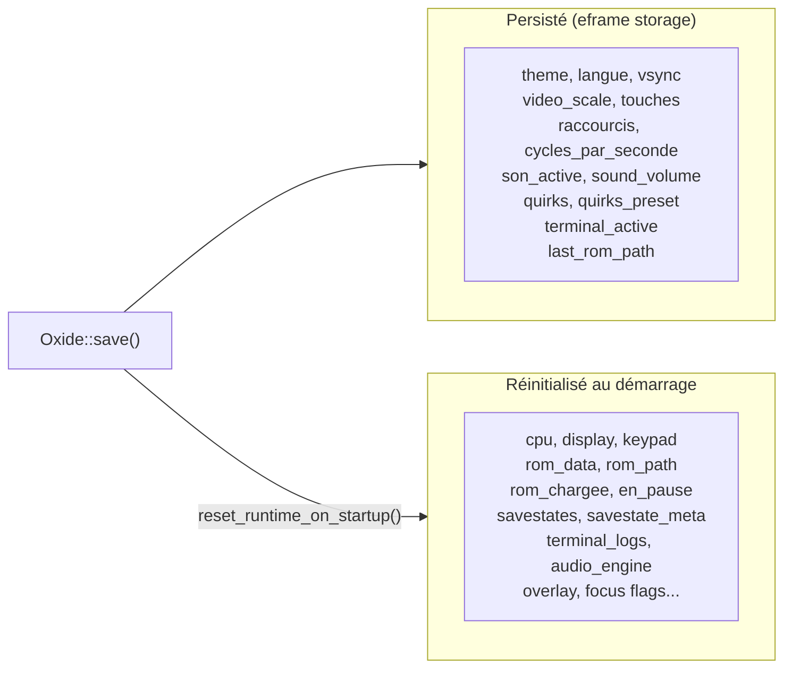
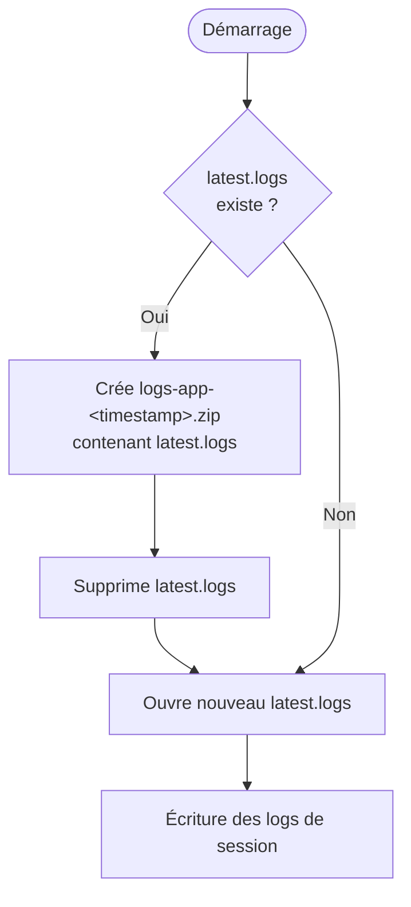

# Oxide — Save States & Persistance

Documentation du système de sauvegarde d'états et de persistance des données.

---

## Vue d'ensemble

Oxide dispose de deux systèmes de persistance distincts :

1. **Paramètres utilisateur** — via `eframe::Storage` (JSON interne eframe)
2. **Save states** — fichiers `.state` par ROM, dans le dossier `savestates/`

---

## Structure des données d'un save state



---

## Organisation des fichiers sur disque

```
savestates/
└── <nom_rom>-<hash_fnv1a>/          ← un dossier par ROM
    ├── <nom>_01_<timestamp>.state   ← slot 1
    ├── <nom>_02_<timestamp>.state   ← slot 2
    └── <nom>_03_<timestamp>.state   ← slot 3
```

> Un seul fichier `.state` par slot est conservé. L'ancien est supprimé avant chaque écriture.

---

## Identification des ROMs



---

## Flux de sauvegarde d'un slot

```mermaid
sequenceDiagram
    actor User
    participant App
    participant Disk

    User->>App: save_state_slot_manual(slot)\nou raccourci clavier

    alt Slot déjà occupé (manual)
        App->>User: Fenêtre de confirmation\n"Écraser le slot N ?"
        User->>App: Confirme
    end

    App->>App: save_state_slot_commit(slot, manual)
    App->>App: savestates[slot] = EmuSnapshot { cpu, display, memory }
    App->>App: savestate_meta[slot] = SaveStateMeta { name, timestamp }
    App->>App: persist_savestate(slot)
    App->>Disk: Supprime ancien fichier du slot
    App->>Disk: Écrit &lt;nom&gt;_&lt;slot&gt;_&lt;timestamp&gt;.state (JSON)
    App->>User: Overlay "État sauvegardé dans le slot N"
```

---

## Flux de chargement d'un slot

```mermaid
flowchart TD
    A([load_state_slot N]) --> B{savestates[N] existe ?}
    B -- Non --> C["status: Slot vide N\noverlay affiché"]
    B -- Oui --> D["cpu = snapshot.cpu\ndisplay = snapshot.display"]
    D --> E{memory.len() correct ?}
    E -- Oui --> F["cpu.memory.copy_from_slice(&snapshot.memory)"]
    E -- Non --> G["cpu.load_program(&rom_data) — fallback"]
    F --> H["rom_chargee = true\nen_pause = false\nreset_runtime_clocks()"]
    G --> H
    H --> I([Émulation reprend])
```

---

## Chargement auto des saves au démarrage d'une ROM



---

## Persistance des paramètres (eframe::Storage)



---

## Logs automatiques (rotation ZIP)



```
logs/
├── app/
│   ├── latest.logs              ← session en cours
│   └── logs-app-2025-01-01_...zip
└── emulator/
    ├── latest.logs
    └── logs-emulator-2025-01-01_...zip
```