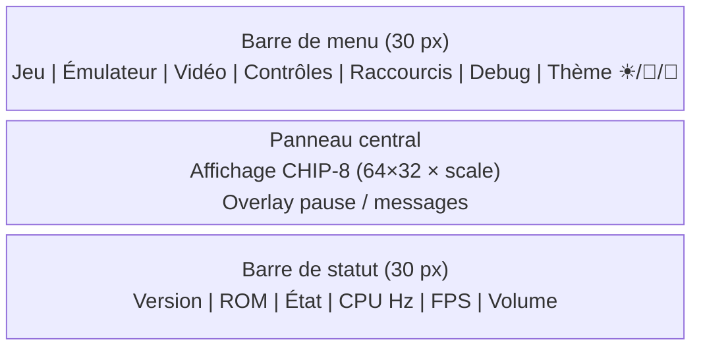
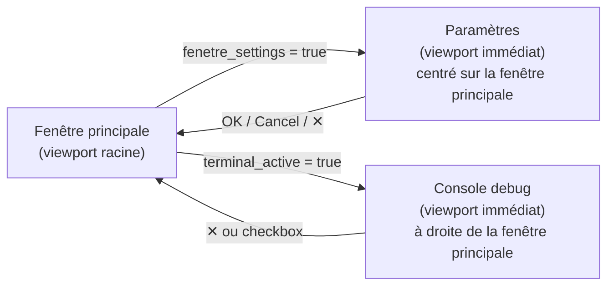
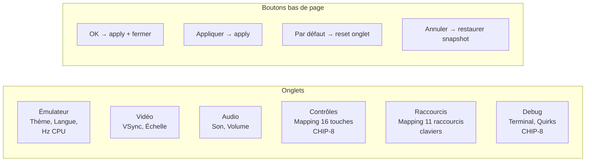
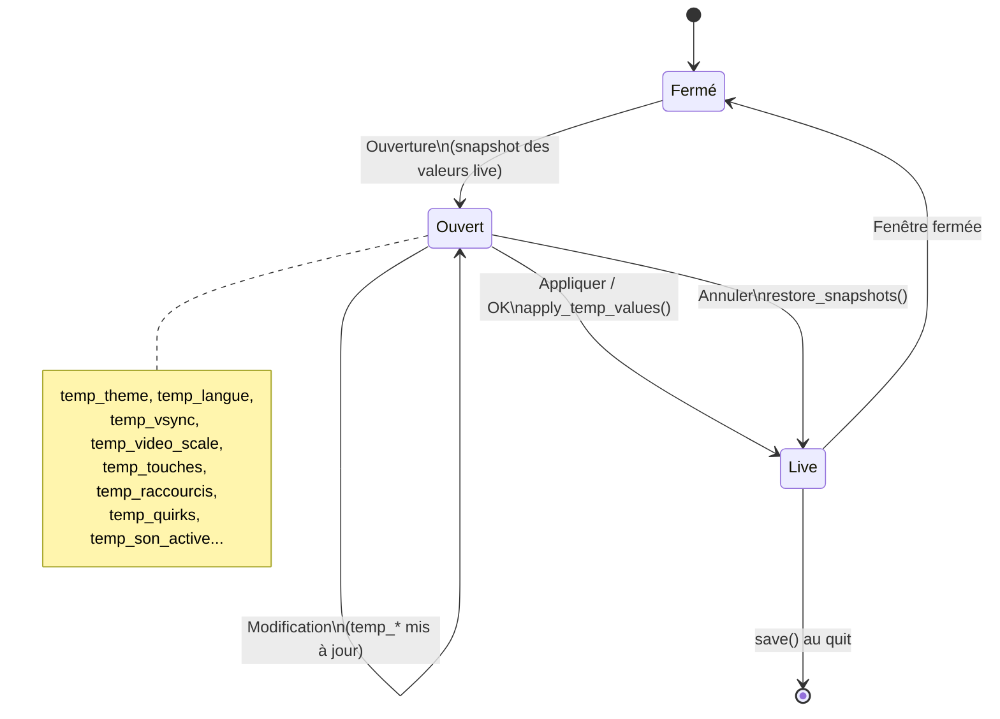
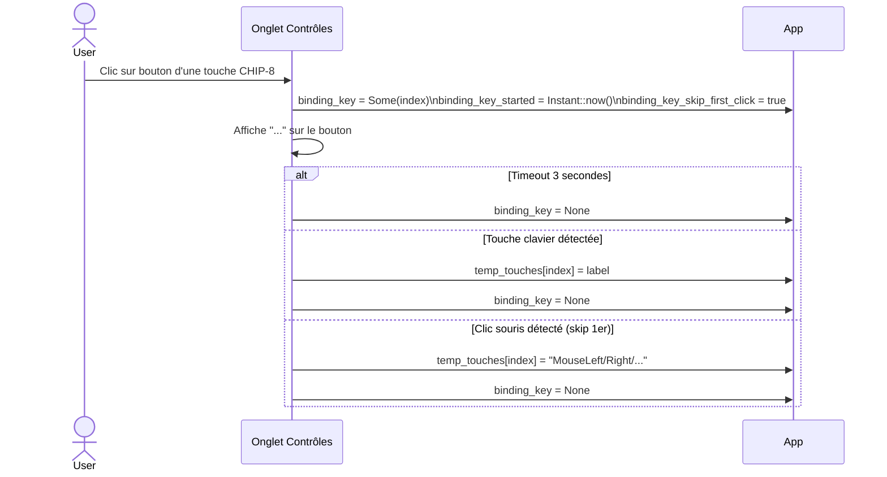
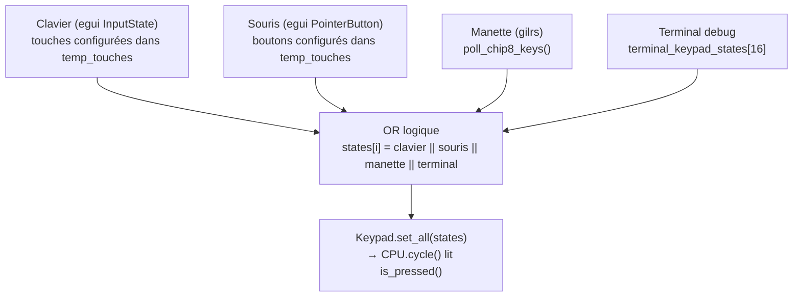
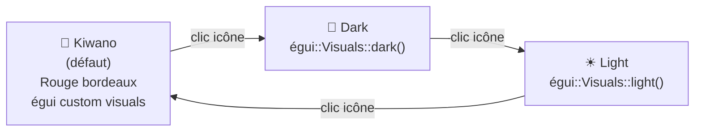
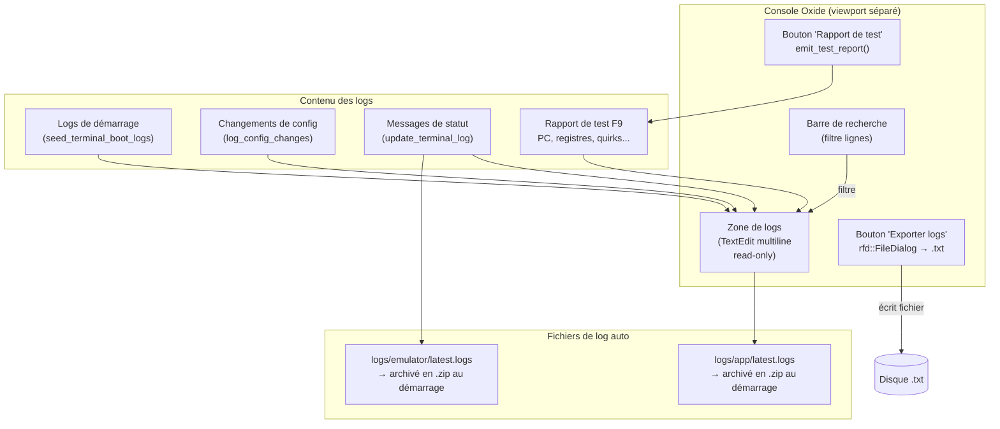

# Oxide — Interface Utilisateur & Paramètres

Documentation de l'interface graphique, des fenêtres et du flux des paramètres.

---

## Disposition de la fenêtre principale

---

## Fenêtres secondaires (viewports détachés)

---

## Onglets des paramètres

---

## Flux des valeurs temporaires (settings)

---

## Binding des touches (contrôles)

---

## Pipeline d'entrées clavier → CHIP-8

---

## Thèmes disponibles

---

## Console debug — fonctionnalités

